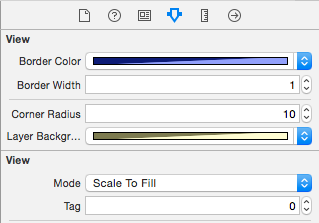
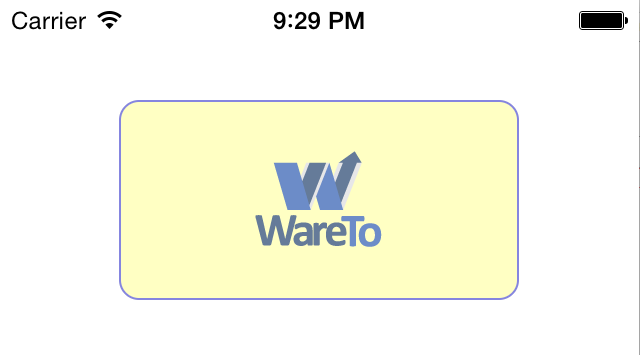

##Using IBInspectable and categories to set a 
##UIView's layer properties from IB.
----

This tutorial is based on a [**github project called IBInspectable_Objective-C**](https://github.com/DuncanMC/IBInspectable_Objective-C.git). (link)

Xcode 6 adds the new attributes `IBInspectable` which lets you mark properties of your custom UIView objects so that they are exposed in (IB) Interface Builder. You can then see and edit the property right from the IB Attributes inspector.

The "Attributes inspector" for the custom properties this project adds look like this:

Prior to the addition of `IBInspectable`, you had to use "User Defined Runtime Attributes" to set custom properties. This was a write-only option, and required that you know the correct keypath and data type to set the desired property, and if you got it wrong, your program crashed at runtime with a very cryptic message about a class not being compliant the KVC protocol for a property.

I often find myself wanting to add a border to views. I might want to make the border of a view's layer a custom color, vary the line thickness, and/or add rounded corners. It is also sometimes usesful to alter the background color of a border's layer (as distinct from the view's background color.)

I've written a simple category on UIView that exposes all of these settings as properties of UIView. Here is the header file for the UIView category:

	IB_DESIGNABLE
	@interface UIView (LayerProperties)
	
	@property (nonatomic, strong) IBInspectable UIColor *borderColor;
	@property (nonatomic, assign) IBInspectable CGFloat borderWidth;
	@property (nonatomic, assign) IBInspectable CGFloat cornerRadius;
	
	@property (nonatomic, strong) IBInspectable UIColor *layerBackgroundColor;
	
	@end

The result of creating a simple UIView with the settings above (light blue 1 point border with a 10 point corner radius) looks like this:

Unfortunately, as of this writing, the IB_DESIGNABLE attribute, which causes Xcode to render your custom views directly in IB, does not seem to work for categories.

The code for the category is below. It's very simple.

	IB_DESIGNABLE
	@implementation UIView (LayerProperties)
	
	//-------------------------------------------------------------------
	//This setter takes a UIColor as input and uses it to set the border
	//color of the view's layer, which is of type CGColor
	
	- (void) setBorderColor:(UIColor *)borderColor
	{
	  self.layer.borderColor = borderColor.CGColor;
	}
	
	//-------------------------------------------------------------------
	
	//This is a getter that lets you query the border color of a view's layer
	
	- (UIColor *) borderColor;
	{
	  return [UIColor colorWithCGColor: self.layer.borderColor];
	}
	
	//-------------------------------------------------------------------
	
	- (void) setLayerBackgroundColor:(UIColor *)layerBackgroundColor
	{
	  self.layer.backgroundColor = layerBackgroundColor.CGColor;
	}
	
	- (UIColor *) layerBackgroundColor;
	{
	  return [UIColor colorWithCGColor: self.layer.backgroundColor];
	}
	
	//-------------------------------------------------------------------
	
	- (CGFloat) borderWidth;
	{
	  return self.layer.borderWidth;
	}
	
	//-------------------------------------------------------------------
	
	- (void) setBorderWidth: (CGFloat) borderWidth;
	{
	  self.layer.borderWidth = borderWidth;
	}
	
	//-------------------------------------------------------------------
	
	
	- (CGFloat) cornerRadius;
	{
	  return self.layer.cornerRadius;
	}
	
	//-------------------------------------------------------------------
	
	- (void) setCornerRadius: (CGFloat) cornerRadius;
	{
	  self.layer.cornerRadius = cornerRadius;
	}
	
	@end
